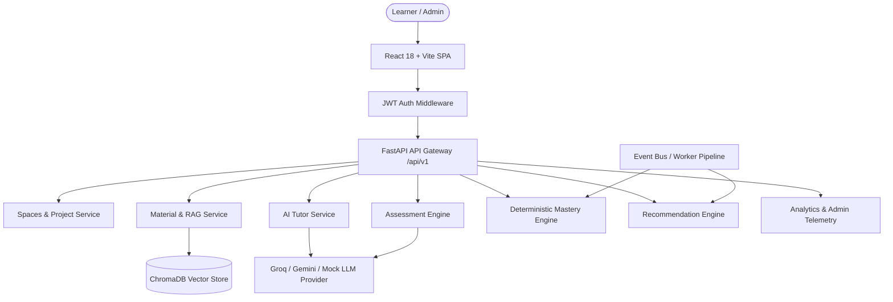

# System Architecture — AI Prof Platform

## Overview

AI Prof is an enterprise-grade multi-tenant SaaS learning platform designed for structured study, grounded AI tutoring, deterministic concept mastery evaluation, and event-driven learning recommendations.

## Architectural Components

### 1. Frontend Layer (Single Page Application)
- **Framework**: React 18, Vite, TypeScript, TailwindCSS
- **State & Routing**: React Router v6, Axios HTTP client with request/response interceptors for Bearer JWT injection.
- **Charts & UI**: Recharts data visualization library, Lucide React icon suite.

### 2. Backend API Gateway & Middleware Layer
- **Framework**: FastAPI (Python 3.12+)
- **Request Tracing**: `request_tracing_middleware` attaches unique `x-request-id` headers to all inbound HTTP calls.
- **Error Handling**: Standardized exception handling via `ErrorResponse` schema.
- **Security**: Strict multi-tenant verification (`TenantAccessDeniedError`).

### 3. Material Parsing & Vector RAG Layer
- **PDF Extraction**: PyMuPDF (`fitz`) engine parses raw study documents.
- **Chunking Engine**: Recursive text chunking ($500$-character window, $50$-character overlap).
- **Vector Indexing**: ChromaDB vector store generating embeddings for fast cosine similarity search.

### 4. Deterministic Concept Mastery Engine
- **Mastery Formula**: Algorithmic scoring incorporating assessment accuracy, question difficulty weight, repeated error penalties, and time decay.
- **Explainability**: Every snapshot records historical mastery, new mastery, evidence type, and timestamp.

### 5. AI Observability & Provider Layer
- **Interface**: `AbstractLLMProvider` abstraction allowing seamless provider swapping.
- **Providers**: Groq (`llama-3.3-70b-versatile`), Gemini (`gemini-1.5-flash`), `MockLLMProvider` fallback.
- **Telemetry**: Tracks token consumption, latency, and provider share.
