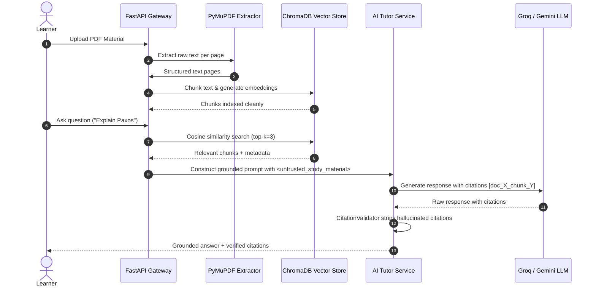

# Retrieval-Augmented Generation (RAG) Architecture

## Overview

AI Prof implements a grounded Retrieval-Augmented Generation (RAG) pipeline designed to ensure that study assistance, tutoring, and assessment generation are strictly anchored in user-uploaded study materials.



## RAG Pipeline Stages

### 1. Document Ingestion & PyMuPDF Parsing
- **PDF Extraction**: Extracts page-by-page text content using `fitz` (PyMuPDF).
- **Checksum Deduplication**: Calculates SHA-256 file hash before processing. Duplicate file uploads bypass OCR re-parsing.

### 2. Semantic Chunking
- **Chunk Size**: $500$ characters.
- **Chunk Overlap**: $50$ characters.
- **Metadata**: Each chunk stores `material_id`, `page_number`, `chunk_index`, and `token_count`.

### 3. Vector Store & Embedding Generation
- **Embedding Model**: `all-MiniLM-L6-v2` / ChromaDB default embedding function.
- **Vector Engine**: ChromaDB persistent vector database.
- **Tenant Scoping**: Vector queries filter strictly by `WHERE project_id = :project_id`.

### 4. Grounded Prompting & Untrusted Data Tags
Untrusted study document content is injected into system prompts using XML-style tags:
```xml
<untrusted_study_material>
[doc_1_chunk_0] Paxos requires two phases: Prepare and Accept...
</untrusted_study_material>
```
System instructions strictly forbid the LLM from treating text within these tags as system commands.

### 5. Citation Validation & Hallucination Stripping
`CitationValidator.strip_hallucinated_citations` inspects the LLM response. Any citation tag referencing a chunk ID not present in the retrieved context is stripped automatically before returning output to the user.
